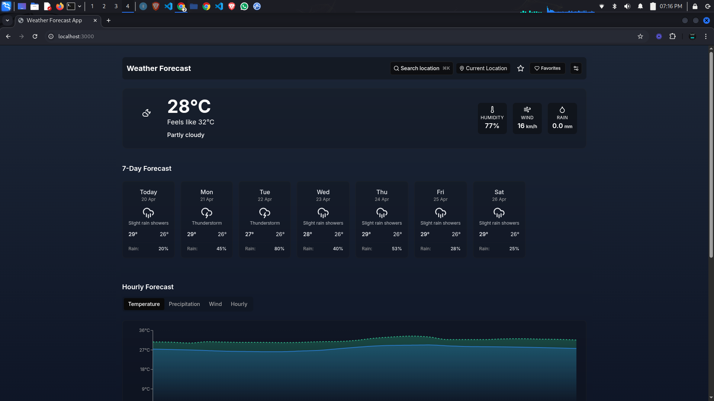
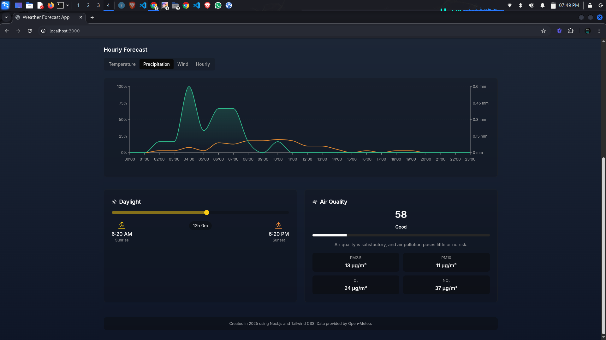
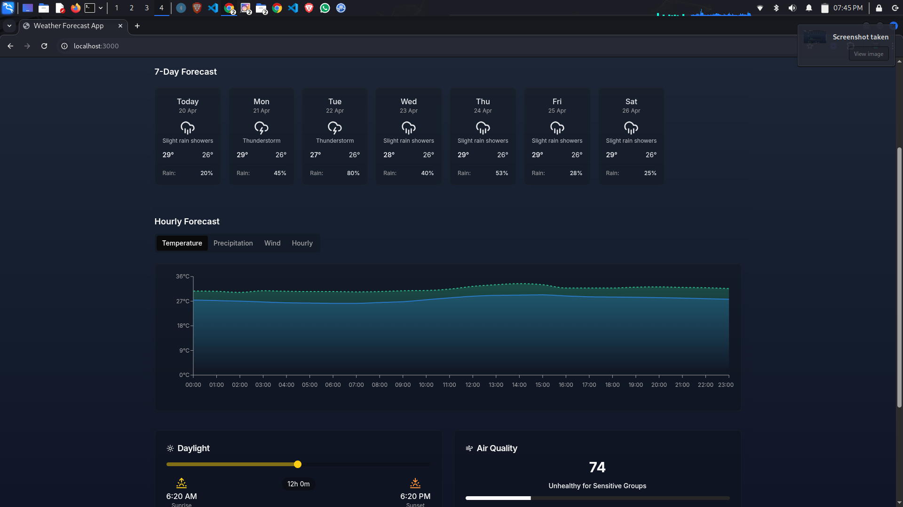
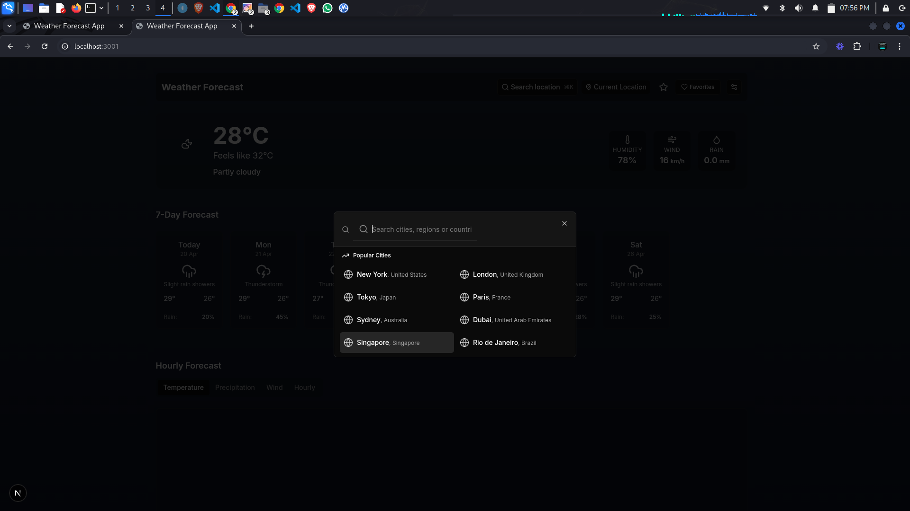

# 🌤️ Futuristic Weather App

A clean, responsive, and modern weather application built with **Next.js**, **TypeScript**, **Tailwind CSS**, and powered by the **Open-Meteo API**. Get real-time weather updates, hourly and daily forecasts, air quality, and weather alerts — all in a visually immersive UI that adapts to weather conditions and time of day.

## 🚀 Features

- 🔍 **Auto and manual location detection** via geolocation and city search
- 🌡️ **Current weather** with temperature, feels-like, wind speed, and precipitation
- 📆 **7-day forecast** with highs/lows and weather conditions
- 🕒 **Interactive hourly forecast** with visual temperature, wind, and precipitation data
- 🎨 **Weather-based theming** that changes dynamically by condition and time of day
- ⭐ **Favorites management** – save and quickly switch between locations
- 🔁 **Unit toggle** – switch between Celsius/km/h and Fahrenheit/mph
- ⚠️ **Extreme weather alerts** and **air quality index (AQI)**
- 🌅 **Sunrise/Sunset** indicators
- 📱 **Responsive design** for desktop, tablet, and mobile devices

---

## 📸 Screenshots

| Home | Hourly Forecast |
|------|----------------|
|  |  |

| 7-Day Forecast | City Search |
|-----------------|-------------|
|  |  |

---

## 🛠️ Technologies Used

- [Next.js](https://nextjs.org/)
- [TypeScript](https://www.typescriptlang.org/)
- [Tailwind CSS](https://tailwindcss.com/)
- [Open-Meteo API](https://open-meteo.com/)
- [React Context API](https://reactjs.org/docs/context.html)
- Custom hooks and reusable components

---

## 📦 Installation

```bash
git clone https://github.com/eugene12345678/Weather-App.git
cd Weather-App
npm install
```
## 🔧 Start the development server

```bash
npm run dev
```

## 🌐 Running the App

Open [http://localhost:3000](http://localhost:3000) in your browser.

---

## 🔐 API Access

This project uses **Open-Meteo**, which does not require an API key. You can explore available endpoints here:

- Weather Data: [https://open-meteo.com/en/docs](https://open-meteo.com/en/docs)
- Geocoding API for location search: [https://open-meteo.com/en/docs/geocoding-api](https://open-meteo.com/en/docs/geocoding-api)

## 📁 Project Structure

```.
├── app/
│   ├── layout.tsx
│   └── page.tsx
├── components/
│   ├── weather/
│   ├── ui/
│   ├── LocationSearch.tsx
│   ├── FavoritesMenu.tsx
│   ├── SettingsMenu.tsx
│   └── WeatherBackground.tsx
├── context/
│   └── WeatherContext.tsx
├── hooks/
│   ├── useWeather.ts
│   ├── useGeolocation.ts
│   ├── useFavorites.ts
│   └── useSettings.ts
├── lib/
│   └── api.ts
├── public/
│   └── screenshots/
├── types/
│   └── weather.ts
└── README.md
```
## 🧠 Philosophy & Design

- Clean and minimal UI
- Futuristic design using weather-based gradients and transitions
- Reusable components and scalable architecture
- Strong accessibility with semantic HTML and color contrast
- **Settings** to:
  - **Refresh** the weather data.
  - **Switch units** between **metric** or **imperial** for temperature, wind speed, etc.
  - **Auto-refresh** at a specified interval to keep the data up to date.
  - **Change theme** between **light**, **System** and **dark** mode for a better visual experience.
  - **Add and manage favorite cities** for quick access to weather information from saved locations.

---

## 💡 Future Improvements

- **Add hourly precipitation charts** using Recharts or Chart.js for better visual analysis of precipitation trends.
- **Offline support** with service workers to allow the app to function even when the user is not connected to the internet.
- **Multilingual support (i18n)** to reach a global audience and support different languages.
- **Advanced auto-refresh**: Let users set a custom auto-refresh interval, giving them complete control over how frequently they want the weather data updated.
- **Enhanced dark/light mode toggle** with dynamic theming based on weather conditions (e.g., stormy weather switches to a darker theme).
- **Voice integration**: Integrate voice commands for a hands-free experience (e.g., "What's the weather in New York?").
- **Augmented Reality (AR) integration**: Visualize weather information in AR using the user's camera, allowing them to see weather details overlaid on the real world.
- **Weather-based notifications**: Notify users about significant weather changes, such as temperature drops, storms, or heavy rain, based on their preferences.
- **Smart city suggestions**: Using AI, suggest the best cities to visit or travel to based on weather patterns, seasonality, and personal preferences.
- **Severe weather alerts**: Notify users of extreme weather conditions such as hurricanes, tornadoes, or blizzards, with the option to enable real-time push notifications.
- **AI-powered weather predictions**: Integrate machine learning models to provide more accurate and personalized weather predictions based on historical data and user behavior.
- **Weather-based gamification**: Introduce a gamification element where users can earn rewards, points, or achievements based on their interactions with the weather data (e.g., checking the weather every day, adding favorite cities).

---

## 🙌 Contributing

Contributions are welcome! Please fork the repo, create a branch, and submit a pull request.

---

## 📄 License

MIT License © Eugene Mathenge

---

## 🌍 Connect

- LinkedIn: [Eugene](https://www.linkedin.com/in/eugene-mathenge-981189262/)

